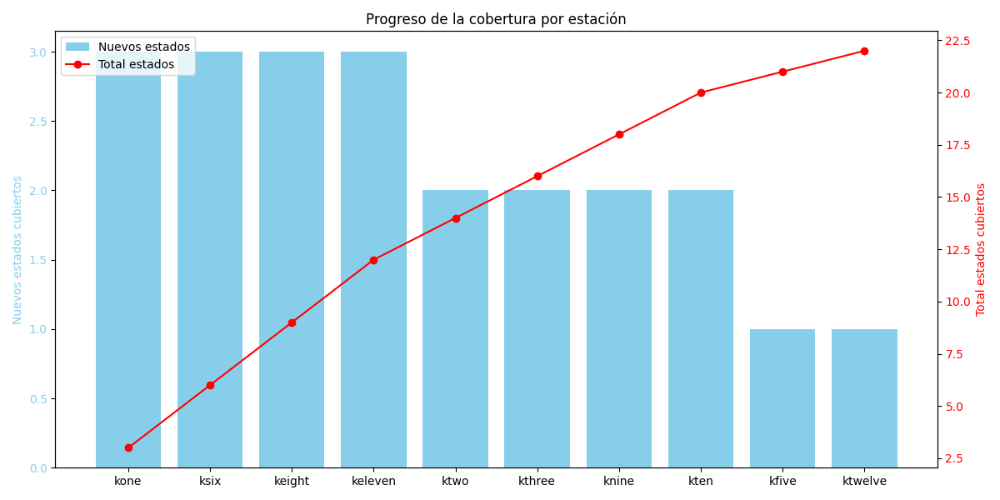

# Optimización de Cobertura de Estaciones de Radio

## Descripción del Problema
Este proyecto aborda un problema clásico de optimización en Inteligencia Artificial conocido como "_Set Covering Problem_". El objetivo es encontrar el número mínimo de estaciones de radio necesarias para cubrir todos los estados de Estados Unidos (específicamente, los estados del oeste y centro del país).

Está basado en el ejercicio propuesto en el capítulo 8 _Greedy Algorithms_ del libro grokking [_Algorithms: An illustrated guide for programmers and other curious people_ de Aditya Y. Bhargava](https://github.com/egonSchiele/grokking_algorithms)

## Instalación y Configuración

### Requisitos Previos
- Python ≥ 3.11
- [uv](https://github.com/astral-sh/uv) (gestor de paquetes de Python)

### Pasos de Instalación

1. Clonar el repositorio:
```bash
git clone <url-del-repositorio>
cd greedy-search
```

2. Crear y activar un entorno virtual con uv:
```bash
uv venv
source .venv/bin/activate  # En Linux/MacOS
# o
.venv\Scripts\activate     # En Windows
```

3. Instalar las dependencias:
```bash
uv pip install .
```

4. (Opcional) Instalar dependencias de desarrollo:
```bash
uv pip install ".[lint]"
```

### Dependencias Principales
- matplotlib ≥ 3.10.1
- ruff ≥ 0.9.9 (para linting, opcional)

### Contexto
- Tenemos un conjunto de estados que necesitan cobertura de radio
- Disponemos de varias estaciones de radio, cada una cubriendo diferentes conjuntos de estados
- Debemos seleccionar el menor número de estaciones posible que cubran todos los estados requeridos

### Cobertura de Estaciones
La siguiente tabla muestra los estados que cubre cada estación de radio:

| Estación   | Estados Cubiertos |
|------------|------------------|
| kone       | Idaho (ID), Nevada (NV), Utah (UT) |
| ktwo       | Washington (WA), Idaho (ID), Montana (MT) |
| kthree     | Oregon (OR), Nevada (NV), California (CA) |
| kfour      | Nevada (NV), Utah (UT) |
| kfive      | California (CA), Arizona (AZ) |
| ksix       | New Mexico (NM), Texas (TX), Oklahoma (OK) |
| kseven     | Oklahoma (OK), Kansas (KS), Colorado (CO) |
| keight     | Kansas (KS), Colorado (CO), Nebraska (NE) |
| knine      | Nebraska (NE), South Dakota (SD), Wyoming (WY) |
| kten       | North Dakota (ND), Iowa (IA) |
| keleven    | Minnesota (MN), Missouri (MO), Arkansas (AR) |
| ktwelve    | Louisiana (LA) |
| kthirteen  | Missouri (MO), Arkansas (AR) |

## Implementación

El proyecto implementa dos estrategias diferentes de búsqueda:

### 1. Búsqueda Ávida Global (`greedy_search_global()`)
Esta función implementa una estrategia de búsqueda ávida (greedy) que:
- En cada paso, selecciona la estación que cubre el mayor número de estados no cubiertos hasta el momento
- Mantiene un registro de los estados cubiertos y las estaciones seleccionadas
- Escapa de mínimos locales al considerar siempre la mejor opción global disponible


*La gráfica muestra cómo cada estación seleccionada contribuye a la cobertura total de estados*

### 2. Búsqueda Ávida Local (`greedy_search_local()`)
Esta función demuestra el problema de los mínimos locales:
- Realiza múltiples intentos aleatorios seleccionando 10 estaciones en cada iteración
- No considera la optimización global, sino que se basa en selecciones aleatorias
- Queda atrapada en mínimos locales, resultando en soluciones subóptimas


*La gráfica muestra cómo diferentes iteraciones quedan atrapadas en mínimos locales, pero alcanzando en una de ellas el mínimo global*


*La gráfica muestra cómo diferentes iteraciones quedan atrapadas en mínimos locales, sin alcanzar la cobertura total*

## Resultados
- La búsqueda ávida global encuentra una solución óptima o cercana a la óptima
- La búsqueda local demuestra cómo las estrategias no optimizadas pueden quedar atrapadas en soluciones subóptimas
- Las visualizaciones permiten comparar la efectividad de ambos enfoques

## Referencias
- [Call Letters in the United States](https://earlyradiohistory.us/kwtrivia.htm)
- [Call signs in the United States](https://en.wikipedia.org/wiki/Call_signs_in_the_United_States)
- [FM Radio Stations in the US](https://en.wikipedia.org/wiki/List_of_FM_radio_stations_in_the_United_States_by_call_sign_(initial_letters_KK%E2%80%93KM))